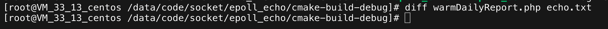
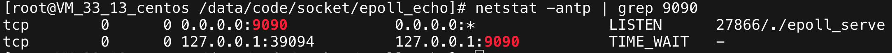

# 使用epoll和非阻塞IO实现单进程回射服务器

## 1. 使用

1. 运行epoll_server

    ```sh
    cd epoll_echo/cmake-build-debug;
    ./epoll_server
    ```

2. 运行epoll_client

    client也使用epoll来实现IO多路复用，stdin和stdout也被设置为非阻塞，但是epoll_ctl貌似不支持对stdin和stdout进行重定向，所以只能使用如下方式运行client。输入为文件warmDailyReport.php(1000多行)，输出通过`tee`命令显示到终端同时写入到echo.txt文件。通过ctrl+C结束客户端。

    ```sh
    cd epoll_echo/cmake-build-debug
    cat warmDailyReport.php | ./epoll_client | tee echo.txt
    ```

3. 正确性验证

    执行`diff`命令，查看echo得到的文件与原始文件的区别：

    

    通过ctrl+D结束客户端后，socket可以正常断开连接：

    

    client输出：

    ```log
    /data/code/socket/epoll_echo/Client.cpp(60)-<run>: epoll in fd 0
    /data/code/socket/epoll_echo/Client.cpp(199)-<do_recv>: read done from fd: 0, total nbytes: 2048
    /data/code/socket/epoll_echo/Client.cpp(60)-<run>: epoll in fd 0
    /data/code/socket/epoll_echo/Client.cpp(139)-<do_recv>: stdin can read, buf _stdin2sock have no empty space to read!
    /data/code/socket/epoll_echo/Client.cpp(102)-<run>: epollout fd 3
    /data/code/socket/epoll_echo/Client.cpp(246)-<do_send>: send fd: 3 done, total nbteys: 2048
    /data/code/socket/epoll_echo/Client.cpp(60)-<run>: epoll in fd 0
    /data/code/socket/epoll_echo/Client.cpp(199)-<do_recv>: read done from fd: 0, total nbytes: 2048
    /data/code/socket/epoll_echo/Client.cpp(60)-<run>: epoll in fd 0
    /data/code/socket/epoll_echo/Client.cpp(139)-<do_recv>: stdin can read, buf _stdin2sock have no empty space to read!
    /data/code/socket/epoll_echo/Client.cpp(102)-<run>: epollout fd 3
    /data/code/socket/epoll_echo/Client.cpp(246)-<do_send>: send fd: 3 done, total nbteys: 2048
    /data/code/socket/epoll_echo/Client.cpp(60)-<run>: epoll in fd 0
    /data/code/socket/epoll_echo/Client.cpp(199)-<do_recv>: read done from fd: 0, total nbytes: 2048
    /data/code/socket/epoll_echo/Client.cpp(60)-<run>: epoll in fd 0
    /data/code/socket/epoll_echo/Client.cpp(139)-<do_recv>: stdin can read, buf _stdin2sock have no empty space to read!
    /data/code/socket/epoll_echo/Client.cpp(102)-<run>: epollout fd 3
    /data/code/socket/epoll_echo/Client.cpp(246)-<do_send>: send fd: 3 done, total nbteys: 2048
    /data/code/socket/epoll_echo/Client.cpp(60)-<run>: epoll in fd 0
    /data/code/socket/epoll_echo/Client.cpp(199)-<do_recv>: read done from fd: 0, total nbytes: 2048
    /data/code/socket/epoll_echo/Client.cpp(60)-<run>: epoll in fd 3
    /data/code/socket/epoll_echo/Client.cpp(199)-<do_recv>: read done from fd: 3, total nbytes: 2048
    /data/code/socket/epoll_echo/Client.cpp(60)-<run>: epoll in fd 0
    /data/code/socket/epoll_echo/Client.cpp(139)-<do_recv>: stdin can read, buf _stdin2sock have no empty space to read!
    /data/code/socket/epoll_echo/Client.cpp(102)-<run>: epollout fd 3
    /data/code/socket/epoll_echo/Client.cpp(246)-<do_send>: send fd: 3 done, total nbteys: 2048
    /data/code/socket/epoll_echo/Client.cpp(102)-<run>: epollout fd 1
    /data/code/socket/epoll_echo/Client.cpp(246)-<do_send>: send fd: 1 done, total nbteys: 2048
    /data/code/socket/epoll_echo/Client.cpp(60)-<run>: epoll in fd 0
    /data/code/socket/epoll_echo/Client.cpp(199)-<do_recv>: read done from fd: 0, total nbytes: 2048
    /data/code/socket/epoll_echo/Client.cpp(60)-<run>: epoll in fd 3
    /data/code/socket/epoll_echo/Client.cpp(199)-<do_recv>: read done from fd: 3, total nbytes: 2048
    /data/code/socket/epoll_echo/Client.cpp(60)-<run>: epoll in fd 0
    /data/code/socket/epoll_echo/Client.cpp(139)-<do_recv>: stdin can read, buf _stdin2sock have no empty space to read!
    /data/code/socket/epoll_echo/Client.cpp(102)-<run>: epollout fd 3
    /data/code/socket/epoll_echo/Client.cpp(246)-<do_send>: send fd: 3 done, total nbteys: 2048
    /data/code/socket/epoll_echo/Client.cpp(102)-<run>: epollout fd 1
    /data/code/socket/epoll_echo/Client.cpp(246)-<do_send>: send fd: 1 done, total nbteys: 2048
    /data/code/socket/epoll_echo/Client.cpp(60)-<run>: epoll in fd 0
    /data/code/socket/epoll_echo/Client.cpp(199)-<do_recv>: read done from fd: 0, total nbytes: 2048
    /data/code/socket/epoll_echo/Client.cpp(60)-<run>: epoll in fd 3
    /data/code/socket/epoll_echo/Client.cpp(199)-<do_recv>: read done from fd: 3, total nbytes: 2048
    /data/code/socket/epoll_echo/Client.cpp(60)-<run>: epoll in fd 0
    /data/code/socket/epoll_echo/Client.cpp(139)-<do_recv>: stdin can read, buf _stdin2sock have no empty space to read!
    /data/code/socket/epoll_echo/Client.cpp(102)-<run>: epollout fd 3
    /data/code/socket/epoll_echo/Client.cpp(246)-<do_send>: send fd: 3 done, total nbteys: 2048
    /data/code/socket/epoll_echo/Client.cpp(102)-<run>: epollout fd 1
    /data/code/socket/epoll_echo/Client.cpp(246)-<do_send>: send fd: 1 done, total nbteys: 2048
    /data/code/socket/epoll_echo/Client.cpp(60)-<run>: epoll in fd 0
    /data/code/socket/epoll_echo/Client.cpp(199)-<do_recv>: read done from fd: 0, total nbytes: 2048
    /data/code/socket/epoll_echo/Client.cpp(60)-<run>: epoll in fd 3
    /data/code/socket/epoll_echo/Client.cpp(199)-<do_recv>: read done from fd: 3, total nbytes: 2048
    /data/code/socket/epoll_echo/Client.cpp(60)-<run>: epoll in fd 0
    /data/code/socket/epoll_echo/Client.cpp(139)-<do_recv>: stdin can read, buf _stdin2sock have no empty space to read!
    /data/code/socket/epoll_echo/Client.cpp(102)-<run>: epollout fd 3
    /data/code/socket/epoll_echo/Client.cpp(246)-<do_send>: send fd: 3 done, total nbteys: 2048
    /data/code/socket/epoll_echo/Client.cpp(102)-<run>: epollout fd 1
    /data/code/socket/epoll_echo/Client.cpp(246)-<do_send>: send fd: 1 done, total nbteys: 2048
    /data/code/socket/epoll_echo/Client.cpp(60)-<run>: epoll in fd 0
    /data/code/socket/epoll_echo/Client.cpp(199)-<do_recv>: read done from fd: 0, total nbytes: 2048
    /data/code/socket/epoll_echo/Client.cpp(60)-<run>: epoll in fd 3
    /data/code/socket/epoll_echo/Client.cpp(199)-<do_recv>: read done from fd: 3, total nbytes: 2048
    /data/code/socket/epoll_echo/Client.cpp(60)-<run>: epoll in fd 0
    /data/code/socket/epoll_echo/Client.cpp(139)-<do_recv>: stdin can read, buf _stdin2sock have no empty space to read!
    /data/code/socket/epoll_echo/Client.cpp(102)-<run>: epollout fd 3
    /data/code/socket/epoll_echo/Client.cpp(246)-<do_send>: send fd: 3 done, total nbteys: 2048
    /data/code/socket/epoll_echo/Client.cpp(102)-<run>: epollout fd 1
    /data/code/socket/epoll_echo/Client.cpp(246)-<do_send>: send fd: 1 done, total nbteys: 2048
    /data/code/socket/epoll_echo/Client.cpp(60)-<run>: epoll in fd 0
    /data/code/socket/epoll_echo/Client.cpp(199)-<do_recv>: read done from fd: 0, total nbytes: 2048
    /data/code/socket/epoll_echo/Client.cpp(60)-<run>: epoll in fd 3
    /data/code/socket/epoll_echo/Client.cpp(199)-<do_recv>: read done from fd: 3, total nbytes: 2048
    /data/code/socket/epoll_echo/Client.cpp(60)-<run>: epoll in fd 0
    /data/code/socket/epoll_echo/Client.cpp(139)-<do_recv>: stdin can read, buf _stdin2sock have no empty space to read!
    /data/code/socket/epoll_echo/Client.cpp(102)-<run>: epollout fd 3
    /data/code/socket/epoll_echo/Client.cpp(246)-<do_send>: send fd: 3 done, total nbteys: 2048
    /data/code/socket/epoll_echo/Client.cpp(102)-<run>: epollout fd 1
    /data/code/socket/epoll_echo/Client.cpp(246)-<do_send>: send fd: 1 done, total nbteys: 2048
    /data/code/socket/epoll_echo/Client.cpp(60)-<run>: epoll in fd 0
    /data/code/socket/epoll_echo/Client.cpp(199)-<do_recv>: read done from fd: 0, total nbytes: 2048
    /data/code/socket/epoll_echo/Client.cpp(60)-<run>: epoll in fd 3
    /data/code/socket/epoll_echo/Client.cpp(199)-<do_recv>: read done from fd: 3, total nbytes: 2048
    /data/code/socket/epoll_echo/Client.cpp(60)-<run>: epoll in fd 0
    /data/code/socket/epoll_echo/Client.cpp(139)-<do_recv>: stdin can read, buf _stdin2sock have no empty space to read!
    /data/code/socket/epoll_echo/Client.cpp(102)-<run>: epollout fd 3
    /data/code/socket/epoll_echo/Client.cpp(246)-<do_send>: send fd: 3 done, total nbteys: 2048
    /data/code/socket/epoll_echo/Client.cpp(102)-<run>: epollout fd 1
    /data/code/socket/epoll_echo/Client.cpp(246)-<do_send>: send fd: 1 done, total nbteys: 2048
    /data/code/socket/epoll_echo/Client.cpp(60)-<run>: epoll in fd 0
    /data/code/socket/epoll_echo/Client.cpp(199)-<do_recv>: read done from fd: 0, total nbytes: 2048
    /data/code/socket/epoll_echo/Client.cpp(60)-<run>: epoll in fd 3
    /data/code/socket/epoll_echo/Client.cpp(199)-<do_recv>: read done from fd: 3, total nbytes: 2048
    /data/code/socket/epoll_echo/Client.cpp(60)-<run>: epoll in fd 0
    /data/code/socket/epoll_echo/Client.cpp(139)-<do_recv>: stdin can read, buf _stdin2sock have no empty space to read!
    /data/code/socket/epoll_echo/Client.cpp(102)-<run>: epollout fd 3
    /data/code/socket/epoll_echo/Client.cpp(246)-<do_send>: send fd: 3 done, total nbteys: 2048
    /data/code/socket/epoll_echo/Client.cpp(102)-<run>: epollout fd 1
    /data/code/socket/epoll_echo/Client.cpp(246)-<do_send>: send fd: 1 done, total nbteys: 2048
    /data/code/socket/epoll_echo/Client.cpp(60)-<run>: epoll in fd 0
    /data/code/socket/epoll_echo/Client.cpp(199)-<do_recv>: read done from fd: 0, total nbytes: 2048
    /data/code/socket/epoll_echo/Client.cpp(60)-<run>: epoll in fd 3
    /data/code/socket/epoll_echo/Client.cpp(199)-<do_recv>: read done from fd: 3, total nbytes: 2048
    /data/code/socket/epoll_echo/Client.cpp(60)-<run>: epoll in fd 0
    /data/code/socket/epoll_echo/Client.cpp(139)-<do_recv>: stdin can read, buf _stdin2sock have no empty space to read!
    /data/code/socket/epoll_echo/Client.cpp(102)-<run>: epollout fd 3
    /data/code/socket/epoll_echo/Client.cpp(246)-<do_send>: send fd: 3 done, total nbteys: 2048
    /data/code/socket/epoll_echo/Client.cpp(102)-<run>: epollout fd 1
    /data/code/socket/epoll_echo/Client.cpp(246)-<do_send>: send fd: 1 done, total nbteys: 2048
    /data/code/socket/epoll_echo/Client.cpp(60)-<run>: epoll in fd 0
    /data/code/socket/epoll_echo/Client.cpp(199)-<do_recv>: read done from fd: 0, total nbytes: 2048
    /data/code/socket/epoll_echo/Client.cpp(60)-<run>: epoll in fd 3
    /data/code/socket/epoll_echo/Client.cpp(199)-<do_recv>: read done from fd: 3, total nbytes: 2048
    /data/code/socket/epoll_echo/Client.cpp(60)-<run>: epoll in fd 0
    /data/code/socket/epoll_echo/Client.cpp(139)-<do_recv>: stdin can read, buf _stdin2sock have no empty space to read!
    /data/code/socket/epoll_echo/Client.cpp(102)-<run>: epollout fd 3
    /data/code/socket/epoll_echo/Client.cpp(246)-<do_send>: send fd: 3 done, total nbteys: 2048
    /data/code/socket/epoll_echo/Client.cpp(102)-<run>: epollout fd 1
    /data/code/socket/epoll_echo/Client.cpp(246)-<do_send>: send fd: 1 done, total nbteys: 2048
    /data/code/socket/epoll_echo/Client.cpp(60)-<run>: epoll in fd 0
    /data/code/socket/epoll_echo/Client.cpp(199)-<do_recv>: read done from fd: 0, total nbytes: 2048
    /data/code/socket/epoll_echo/Client.cpp(60)-<run>: epoll in fd 3
    /data/code/socket/epoll_echo/Client.cpp(199)-<do_recv>: read done from fd: 3, total nbytes: 2048
    /data/code/socket/epoll_echo/Client.cpp(60)-<run>: epoll in fd 0
    /data/code/socket/epoll_echo/Client.cpp(139)-<do_recv>: stdin can read, buf _stdin2sock have no empty space to read!
    /data/code/socket/epoll_echo/Client.cpp(102)-<run>: epollout fd 3
    /data/code/socket/epoll_echo/Client.cpp(246)-<do_send>: send fd: 3 done, total nbteys: 2048
    /data/code/socket/epoll_echo/Client.cpp(102)-<run>: epollout fd 1
    /data/code/socket/epoll_echo/Client.cpp(246)-<do_send>: send fd: 1 done, total nbteys: 2048
    /data/code/socket/epoll_echo/Client.cpp(60)-<run>: epoll in fd 0
    /data/code/socket/epoll_echo/Client.cpp(199)-<do_recv>: read done from fd: 0, total nbytes: 2048
    /data/code/socket/epoll_echo/Client.cpp(60)-<run>: epoll in fd 3
    /data/code/socket/epoll_echo/Client.cpp(199)-<do_recv>: read done from fd: 3, total nbytes: 2048
    /data/code/socket/epoll_echo/Client.cpp(60)-<run>: epoll in fd 0
    /data/code/socket/epoll_echo/Client.cpp(139)-<do_recv>: stdin can read, buf _stdin2sock have no empty space to read!
    /data/code/socket/epoll_echo/Client.cpp(102)-<run>: epollout fd 3
    /data/code/socket/epoll_echo/Client.cpp(246)-<do_send>: send fd: 3 done, total nbteys: 2048
    /data/code/socket/epoll_echo/Client.cpp(102)-<run>: epollout fd 1
    /data/code/socket/epoll_echo/Client.cpp(246)-<do_send>: send fd: 1 done, total nbteys: 2048
    /data/code/socket/epoll_echo/Client.cpp(60)-<run>: epoll in fd 0
    /data/code/socket/epoll_echo/Client.cpp(199)-<do_recv>: read done from fd: 0, total nbytes: 2048
    /data/code/socket/epoll_echo/Client.cpp(60)-<run>: epoll in fd 3
    /data/code/socket/epoll_echo/Client.cpp(199)-<do_recv>: read done from fd: 3, total nbytes: 2048
    /data/code/socket/epoll_echo/Client.cpp(60)-<run>: epoll in fd 0
    /data/code/socket/epoll_echo/Client.cpp(139)-<do_recv>: stdin can read, buf _stdin2sock have no empty space to read!
    /data/code/socket/epoll_echo/Client.cpp(102)-<run>: epollout fd 3
    /data/code/socket/epoll_echo/Client.cpp(246)-<do_send>: send fd: 3 done, total nbteys: 2048
    /data/code/socket/epoll_echo/Client.cpp(102)-<run>: epollout fd 1
    /data/code/socket/epoll_echo/Client.cpp(246)-<do_send>: send fd: 1 done, total nbteys: 2048
    /data/code/socket/epoll_echo/Client.cpp(60)-<run>: epoll in fd 0
    /data/code/socket/epoll_echo/Client.cpp(199)-<do_recv>: read done from fd: 0, total nbytes: 2048
    /data/code/socket/epoll_echo/Client.cpp(60)-<run>: epoll in fd 3
    /data/code/socket/epoll_echo/Client.cpp(199)-<do_recv>: read done from fd: 3, total nbytes: 2048
    /data/code/socket/epoll_echo/Client.cpp(60)-<run>: epoll in fd 0
    /data/code/socket/epoll_echo/Client.cpp(139)-<do_recv>: stdin can read, buf _stdin2sock have no empty space to read!
    /data/code/socket/epoll_echo/Client.cpp(102)-<run>: epollout fd 3
    /data/code/socket/epoll_echo/Client.cpp(246)-<do_send>: send fd: 3 done, total nbteys: 2048
    /data/code/socket/epoll_echo/Client.cpp(102)-<run>: epollout fd 1
    /data/code/socket/epoll_echo/Client.cpp(246)-<do_send>: send fd: 1 done, total nbteys: 2048
    /data/code/socket/epoll_echo/Client.cpp(60)-<run>: epoll in fd 0
    /data/code/socket/epoll_echo/Client.cpp(199)-<do_recv>: read done from fd: 0, total nbytes: 2048
    /data/code/socket/epoll_echo/Client.cpp(60)-<run>: epoll in fd 3
    /data/code/socket/epoll_echo/Client.cpp(199)-<do_recv>: read done from fd: 3, total nbytes: 2048
    /data/code/socket/epoll_echo/Client.cpp(60)-<run>: epoll in fd 0
    /data/code/socket/epoll_echo/Client.cpp(139)-<do_recv>: stdin can read, buf _stdin2sock have no empty space to read!
    /data/code/socket/epoll_echo/Client.cpp(102)-<run>: epollout fd 3
    /data/code/socket/epoll_echo/Client.cpp(246)-<do_send>: send fd: 3 done, total nbteys: 2048
    /data/code/socket/epoll_echo/Client.cpp(102)-<run>: epollout fd 1
    /data/code/socket/epoll_echo/Client.cpp(246)-<do_send>: send fd: 1 done, total nbteys: 2048
    /data/code/socket/epoll_echo/Client.cpp(60)-<run>: epoll in fd 0
    /data/code/socket/epoll_echo/Client.cpp(199)-<do_recv>: read done from fd: 0, total nbytes: 2048
    /data/code/socket/epoll_echo/Client.cpp(60)-<run>: epoll in fd 3
    /data/code/socket/epoll_echo/Client.cpp(199)-<do_recv>: read done from fd: 3, total nbytes: 2048
    /data/code/socket/epoll_echo/Client.cpp(60)-<run>: epoll in fd 0
    /data/code/socket/epoll_echo/Client.cpp(139)-<do_recv>: stdin can read, buf _stdin2sock have no empty space to read!
    /data/code/socket/epoll_echo/Client.cpp(102)-<run>: epollout fd 3
    /data/code/socket/epoll_echo/Client.cpp(246)-<do_send>: send fd: 3 done, total nbteys: 2048
    /data/code/socket/epoll_echo/Client.cpp(102)-<run>: epollout fd 1
    /data/code/socket/epoll_echo/Client.cpp(246)-<do_send>: send fd: 1 done, total nbteys: 2048
    /data/code/socket/epoll_echo/Client.cpp(60)-<run>: epoll in fd 0
    /data/code/socket/epoll_echo/Client.cpp(199)-<do_recv>: read done from fd: 0, total nbytes: 2048
    /data/code/socket/epoll_echo/Client.cpp(60)-<run>: epoll in fd 3
    /data/code/socket/epoll_echo/Client.cpp(199)-<do_recv>: read done from fd: 3, total nbytes: 2048
    /data/code/socket/epoll_echo/Client.cpp(60)-<run>: epoll in fd 0
    /data/code/socket/epoll_echo/Client.cpp(139)-<do_recv>: stdin can read, buf _stdin2sock have no empty space to read!
    /data/code/socket/epoll_echo/Client.cpp(102)-<run>: epollout fd 3
    /data/code/socket/epoll_echo/Client.cpp(246)-<do_send>: send fd: 3 done, total nbteys: 2048
    /data/code/socket/epoll_echo/Client.cpp(102)-<run>: epollout fd 1
    /data/code/socket/epoll_echo/Client.cpp(246)-<do_send>: send fd: 1 done, total nbteys: 2048
    /data/code/socket/epoll_echo/Client.cpp(60)-<run>: epoll in fd 0
    /data/code/socket/epoll_echo/Client.cpp(199)-<do_recv>: read done from fd: 0, total nbytes: 2048
    /data/code/socket/epoll_echo/Client.cpp(60)-<run>: epoll in fd 3
    /data/code/socket/epoll_echo/Client.cpp(199)-<do_recv>: read done from fd: 3, total nbytes: 2048
    /data/code/socket/epoll_echo/Client.cpp(60)-<run>: epoll in fd 0
    /data/code/socket/epoll_echo/Client.cpp(139)-<do_recv>: stdin can read, buf _stdin2sock have no empty space to read!
    /data/code/socket/epoll_echo/Client.cpp(102)-<run>: epollout fd 3
    /data/code/socket/epoll_echo/Client.cpp(246)-<do_send>: send fd: 3 done, total nbteys: 2048
    /data/code/socket/epoll_echo/Client.cpp(102)-<run>: epollout fd 1
    /data/code/socket/epoll_echo/Client.cpp(246)-<do_send>: send fd: 1 done, total nbteys: 2048
    /data/code/socket/epoll_echo/Client.cpp(60)-<run>: epoll in fd 0
    /data/code/socket/epoll_echo/Client.cpp(199)-<do_recv>: read done from fd: 0, total nbytes: 2048
    /data/code/socket/epoll_echo/Client.cpp(60)-<run>: epoll in fd 3
    /data/code/socket/epoll_echo/Client.cpp(199)-<do_recv>: read done from fd: 3, total nbytes: 2048
    /data/code/socket/epoll_echo/Client.cpp(60)-<run>: epoll in fd 0
    /data/code/socket/epoll_echo/Client.cpp(139)-<do_recv>: stdin can read, buf _stdin2sock have no empty space to read!
    /data/code/socket/epoll_echo/Client.cpp(102)-<run>: epollout fd 3
    /data/code/socket/epoll_echo/Client.cpp(246)-<do_send>: send fd: 3 done, total nbteys: 2048
    /data/code/socket/epoll_echo/Client.cpp(102)-<run>: epollout fd 1
    /data/code/socket/epoll_echo/Client.cpp(246)-<do_send>: send fd: 1 done, total nbteys: 2048
    /data/code/socket/epoll_echo/Client.cpp(60)-<run>: epoll in fd 0
    /data/code/socket/epoll_echo/Client.cpp(199)-<do_recv>: read done from fd: 0, total nbytes: 2048
    /data/code/socket/epoll_echo/Client.cpp(60)-<run>: epoll in fd 3
    /data/code/socket/epoll_echo/Client.cpp(199)-<do_recv>: read done from fd: 3, total nbytes: 2048
    /data/code/socket/epoll_echo/Client.cpp(60)-<run>: epoll in fd 0
    /data/code/socket/epoll_echo/Client.cpp(139)-<do_recv>: stdin can read, buf _stdin2sock have no empty space to read!
    /data/code/socket/epoll_echo/Client.cpp(102)-<run>: epollout fd 3
    /data/code/socket/epoll_echo/Client.cpp(246)-<do_send>: send fd: 3 done, total nbteys: 2048
    /data/code/socket/epoll_echo/Client.cpp(102)-<run>: epollout fd 1
    /data/code/socket/epoll_echo/Client.cpp(246)-<do_send>: send fd: 1 done, total nbteys: 2048
    /data/code/socket/epoll_echo/Client.cpp(60)-<run>: epoll in fd 0
    /data/code/socket/epoll_echo/Client.cpp(199)-<do_recv>: read done from fd: 0, total nbytes: 2048
    /data/code/socket/epoll_echo/Client.cpp(60)-<run>: epoll in fd 3
    /data/code/socket/epoll_echo/Client.cpp(199)-<do_recv>: read done from fd: 3, total nbytes: 2048
    /data/code/socket/epoll_echo/Client.cpp(60)-<run>: epoll in fd 0
    /data/code/socket/epoll_echo/Client.cpp(139)-<do_recv>: stdin can read, buf _stdin2sock have no empty space to read!
    /data/code/socket/epoll_echo/Client.cpp(102)-<run>: epollout fd 3
    /data/code/socket/epoll_echo/Client.cpp(246)-<do_send>: send fd: 3 done, total nbteys: 2048
    /data/code/socket/epoll_echo/Client.cpp(102)-<run>: epollout fd 1
    /data/code/socket/epoll_echo/Client.cpp(246)-<do_send>: send fd: 1 done, total nbteys: 2048
    /data/code/socket/epoll_echo/Client.cpp(60)-<run>: epoll in fd 0
    /data/code/socket/epoll_echo/Client.cpp(199)-<do_recv>: read done from fd: 0, total nbytes: 2048
    /data/code/socket/epoll_echo/Client.cpp(60)-<run>: epoll in fd 3
    /data/code/socket/epoll_echo/Client.cpp(199)-<do_recv>: read done from fd: 3, total nbytes: 2048
    /data/code/socket/epoll_echo/Client.cpp(60)-<run>: epoll in fd 0
    /data/code/socket/epoll_echo/Client.cpp(139)-<do_recv>: stdin can read, buf _stdin2sock have no empty space to read!
    /data/code/socket/epoll_echo/Client.cpp(102)-<run>: epollout fd 3
    /data/code/socket/epoll_echo/Client.cpp(246)-<do_send>: send fd: 3 done, total nbteys: 2048
    /data/code/socket/epoll_echo/Client.cpp(102)-<run>: epollout fd 1
    /data/code/socket/epoll_echo/Client.cpp(246)-<do_send>: send fd: 1 done, total nbteys: 2048
    /data/code/socket/epoll_echo/Client.cpp(60)-<run>: epoll in fd 0
    /data/code/socket/epoll_echo/Client.cpp(199)-<do_recv>: read done from fd: 0, total nbytes: 2048
    /data/code/socket/epoll_echo/Client.cpp(60)-<run>: epoll in fd 3
    /data/code/socket/epoll_echo/Client.cpp(199)-<do_recv>: read done from fd: 3, total nbytes: 2048
    /data/code/socket/epoll_echo/Client.cpp(60)-<run>: epoll in fd 0
    /data/code/socket/epoll_echo/Client.cpp(139)-<do_recv>: stdin can read, buf _stdin2sock have no empty space to read!
    /data/code/socket/epoll_echo/Client.cpp(102)-<run>: epollout fd 3
    /data/code/socket/epoll_echo/Client.cpp(246)-<do_send>: send fd: 3 done, total nbteys: 2048
    /data/code/socket/epoll_echo/Client.cpp(102)-<run>: epollout fd 1
    /data/code/socket/epoll_echo/Client.cpp(246)-<do_send>: send fd: 1 done, total nbteys: 2048
    /data/code/socket/epoll_echo/Client.cpp(60)-<run>: epoll in fd 0
    /data/code/socket/epoll_echo/Client.cpp(199)-<do_recv>: read done from fd: 0, total nbytes: 275
    /data/code/socket/epoll_echo/Client.cpp(60)-<run>: epoll in fd 3
    /data/code/socket/epoll_echo/Client.cpp(199)-<do_recv>: read done from fd: 3, total nbytes: 2048
    /data/code/socket/epoll_echo/Client.cpp(102)-<run>: epollout fd 3
    /data/code/socket/epoll_echo/Client.cpp(246)-<do_send>: send fd: 3 done, total nbteys: 275
    /data/code/socket/epoll_echo/Client.cpp(102)-<run>: epollout fd 1
    /data/code/socket/epoll_echo/Client.cpp(246)-<do_send>: send fd: 1 done, total nbteys: 2048
    /data/code/socket/epoll_echo/Client.cpp(60)-<run>: epoll in fd 3
    /data/code/socket/epoll_echo/Client.cpp(199)-<do_recv>: read done from fd: 3, total nbytes: 2048
    /data/code/socket/epoll_echo/Client.cpp(60)-<run>: epoll in fd 3
    /data/code/socket/epoll_echo/Client.cpp(135)-<do_recv>: sock_fd can read, but _sock2stdout have no empty space to read!
    /data/code/socket/epoll_echo/Epoll.cpp(29)-<add_event>: epoll_ctl register fd: 1 failed! error: File exists
    /data/code/socket/epoll_echo/Client.cpp(102)-<run>: epollout fd 1
    /data/code/socket/epoll_echo/Client.cpp(246)-<do_send>: send fd: 1 done, total nbteys: 2048
    /data/code/socket/epoll_echo/Client.cpp(60)-<run>: epoll in fd 3
    /data/code/socket/epoll_echo/Client.cpp(199)-<do_recv>: read done from fd: 3, total nbytes: 2048
    /data/code/socket/epoll_echo/Client.cpp(60)-<run>: epoll in fd 3
    /data/code/socket/epoll_echo/Client.cpp(135)-<do_recv>: sock_fd can read, but _sock2stdout have no empty space to read!
    /data/code/socket/epoll_echo/Epoll.cpp(29)-<add_event>: epoll_ctl register fd: 1 failed! error: File exists
    /data/code/socket/epoll_echo/Client.cpp(102)-<run>: epollout fd 1
    /data/code/socket/epoll_echo/Client.cpp(246)-<do_send>: send fd: 1 done, total nbteys: 2048
    /data/code/socket/epoll_echo/Client.cpp(60)-<run>: epoll in fd 3
    /data/code/socket/epoll_echo/Client.cpp(199)-<do_recv>: read done from fd: 3, total nbytes: 275
    /data/code/socket/epoll_echo/Client.cpp(102)-<run>: epollout fd 1
    /data/code/socket/epoll_echo/Client.cpp(246)-<do_send>: send fd: 1 done, total nbteys: 275
    ```

    server输出：

    ```log
    /data/code/socket/epoll_echo/Conn.cpp(90)-<handle>: accept fd 5, ip: 127.0.0.1 port: 38634
    /data/code/socket/epoll_echo/Conn.cpp(188)-<add_conn>: cur fd size 0
    /data/code/socket/epoll_echo/Conn.cpp(41)-<handle>: epollin sockfd 5
    /data/code/socket/epoll_echo/Conn.cpp(147)-<do_recv>: read done from fd: 5, total nbytes: 2048
    /data/code/socket/epoll_echo/Conn.cpp(101)-<handle>: epollout fd 5
    /data/code/socket/epoll_echo/Conn.cpp(175)-<do_send>: send fd: 5 done, total nbytes: 2048
    /data/code/socket/epoll_echo/Conn.cpp(41)-<handle>: epollin sockfd 5
    /data/code/socket/epoll_echo/Conn.cpp(147)-<do_recv>: read done from fd: 5, total nbytes: 2048
    /data/code/socket/epoll_echo/Conn.cpp(101)-<handle>: epollout fd 5
    /data/code/socket/epoll_echo/Conn.cpp(175)-<do_send>: send fd: 5 done, total nbytes: 2048
    /data/code/socket/epoll_echo/Conn.cpp(41)-<handle>: epollin sockfd 5
    /data/code/socket/epoll_echo/Conn.cpp(147)-<do_recv>: read done from fd: 5, total nbytes: 2048
    /data/code/socket/epoll_echo/Conn.cpp(101)-<handle>: epollout fd 5
    /data/code/socket/epoll_echo/Conn.cpp(175)-<do_send>: send fd: 5 done, total nbytes: 2048
    /data/code/socket/epoll_echo/Conn.cpp(41)-<handle>: epollin sockfd 5
    /data/code/socket/epoll_echo/Conn.cpp(147)-<do_recv>: read done from fd: 5, total nbytes: 2048
    /data/code/socket/epoll_echo/Conn.cpp(101)-<handle>: epollout fd 5
    /data/code/socket/epoll_echo/Conn.cpp(175)-<do_send>: send fd: 5 done, total nbytes: 2048
    /data/code/socket/epoll_echo/Conn.cpp(41)-<handle>: epollin sockfd 5
    /data/code/socket/epoll_echo/Conn.cpp(147)-<do_recv>: read done from fd: 5, total nbytes: 2048
    /data/code/socket/epoll_echo/Conn.cpp(101)-<handle>: epollout fd 5
    /data/code/socket/epoll_echo/Conn.cpp(175)-<do_send>: send fd: 5 done, total nbytes: 2048
    /data/code/socket/epoll_echo/Conn.cpp(41)-<handle>: epollin sockfd 5
    /data/code/socket/epoll_echo/Conn.cpp(147)-<do_recv>: read done from fd: 5, total nbytes: 2048
    /data/code/socket/epoll_echo/Conn.cpp(101)-<handle>: epollout fd 5
    /data/code/socket/epoll_echo/Conn.cpp(175)-<do_send>: send fd: 5 done, total nbytes: 2048
    /data/code/socket/epoll_echo/Conn.cpp(41)-<handle>: epollin sockfd 5
    /data/code/socket/epoll_echo/Conn.cpp(147)-<do_recv>: read done from fd: 5, total nbytes: 2048
    /data/code/socket/epoll_echo/Conn.cpp(101)-<handle>: epollout fd 5
    /data/code/socket/epoll_echo/Conn.cpp(175)-<do_send>: send fd: 5 done, total nbytes: 2048
    /data/code/socket/epoll_echo/Conn.cpp(41)-<handle>: epollin sockfd 5
    /data/code/socket/epoll_echo/Conn.cpp(147)-<do_recv>: read done from fd: 5, total nbytes: 2048
    /data/code/socket/epoll_echo/Conn.cpp(101)-<handle>: epollout fd 5
    /data/code/socket/epoll_echo/Conn.cpp(175)-<do_send>: send fd: 5 done, total nbytes: 2048
    /data/code/socket/epoll_echo/Conn.cpp(41)-<handle>: epollin sockfd 5
    /data/code/socket/epoll_echo/Conn.cpp(147)-<do_recv>: read done from fd: 5, total nbytes: 2048
    /data/code/socket/epoll_echo/Conn.cpp(101)-<handle>: epollout fd 5
    /data/code/socket/epoll_echo/Conn.cpp(175)-<do_send>: send fd: 5 done, total nbytes: 2048
    /data/code/socket/epoll_echo/Conn.cpp(41)-<handle>: epollin sockfd 5
    /data/code/socket/epoll_echo/Conn.cpp(147)-<do_recv>: read done from fd: 5, total nbytes: 2048
    /data/code/socket/epoll_echo/Conn.cpp(101)-<handle>: epollout fd 5
    /data/code/socket/epoll_echo/Conn.cpp(175)-<do_send>: send fd: 5 done, total nbytes: 2048
    /data/code/socket/epoll_echo/Conn.cpp(41)-<handle>: epollin sockfd 5
    /data/code/socket/epoll_echo/Conn.cpp(147)-<do_recv>: read done from fd: 5, total nbytes: 2048
    /data/code/socket/epoll_echo/Conn.cpp(101)-<handle>: epollout fd 5
    /data/code/socket/epoll_echo/Conn.cpp(175)-<do_send>: send fd: 5 done, total nbytes: 2048
    /data/code/socket/epoll_echo/Conn.cpp(41)-<handle>: epollin sockfd 5
    /data/code/socket/epoll_echo/Conn.cpp(147)-<do_recv>: read done from fd: 5, total nbytes: 2048
    /data/code/socket/epoll_echo/Conn.cpp(101)-<handle>: epollout fd 5
    /data/code/socket/epoll_echo/Conn.cpp(175)-<do_send>: send fd: 5 done, total nbytes: 2048
    /data/code/socket/epoll_echo/Conn.cpp(41)-<handle>: epollin sockfd 5
    /data/code/socket/epoll_echo/Conn.cpp(147)-<do_recv>: read done from fd: 5, total nbytes: 2048
    /data/code/socket/epoll_echo/Conn.cpp(101)-<handle>: epollout fd 5
    /data/code/socket/epoll_echo/Conn.cpp(175)-<do_send>: send fd: 5 done, total nbytes: 2048
    /data/code/socket/epoll_echo/Conn.cpp(41)-<handle>: epollin sockfd 5
    /data/code/socket/epoll_echo/Conn.cpp(147)-<do_recv>: read done from fd: 5, total nbytes: 2048
    /data/code/socket/epoll_echo/Conn.cpp(101)-<handle>: epollout fd 5
    /data/code/socket/epoll_echo/Conn.cpp(175)-<do_send>: send fd: 5 done, total nbytes: 2048
    /data/code/socket/epoll_echo/Conn.cpp(41)-<handle>: epollin sockfd 5
    /data/code/socket/epoll_echo/Conn.cpp(147)-<do_recv>: read done from fd: 5, total nbytes: 2048
    /data/code/socket/epoll_echo/Conn.cpp(101)-<handle>: epollout fd 5
    /data/code/socket/epoll_echo/Conn.cpp(175)-<do_send>: send fd: 5 done, total nbytes: 2048
    /data/code/socket/epoll_echo/Conn.cpp(41)-<handle>: epollin sockfd 5
    /data/code/socket/epoll_echo/Conn.cpp(147)-<do_recv>: read done from fd: 5, total nbytes: 2048
    /data/code/socket/epoll_echo/Conn.cpp(101)-<handle>: epollout fd 5
    /data/code/socket/epoll_echo/Conn.cpp(175)-<do_send>: send fd: 5 done, total nbytes: 2048
    /data/code/socket/epoll_echo/Conn.cpp(41)-<handle>: epollin sockfd 5
    /data/code/socket/epoll_echo/Conn.cpp(147)-<do_recv>: read done from fd: 5, total nbytes: 2048
    /data/code/socket/epoll_echo/Conn.cpp(101)-<handle>: epollout fd 5
    /data/code/socket/epoll_echo/Conn.cpp(175)-<do_send>: send fd: 5 done, total nbytes: 2048
    /data/code/socket/epoll_echo/Conn.cpp(41)-<handle>: epollin sockfd 5
    /data/code/socket/epoll_echo/Conn.cpp(147)-<do_recv>: read done from fd: 5, total nbytes: 2048
    /data/code/socket/epoll_echo/Conn.cpp(101)-<handle>: epollout fd 5
    /data/code/socket/epoll_echo/Conn.cpp(175)-<do_send>: send fd: 5 done, total nbytes: 2048
    /data/code/socket/epoll_echo/Conn.cpp(41)-<handle>: epollin sockfd 5
    /data/code/socket/epoll_echo/Conn.cpp(147)-<do_recv>: read done from fd: 5, total nbytes: 2048
    /data/code/socket/epoll_echo/Conn.cpp(101)-<handle>: epollout fd 5
    /data/code/socket/epoll_echo/Conn.cpp(175)-<do_send>: send fd: 5 done, total nbytes: 2048
    /data/code/socket/epoll_echo/Conn.cpp(41)-<handle>: epollin sockfd 5
    /data/code/socket/epoll_echo/Conn.cpp(147)-<do_recv>: read done from fd: 5, total nbytes: 2048
    /data/code/socket/epoll_echo/Conn.cpp(101)-<handle>: epollout fd 5
    /data/code/socket/epoll_echo/Conn.cpp(175)-<do_send>: send fd: 5 done, total nbytes: 2048
    /data/code/socket/epoll_echo/Conn.cpp(41)-<handle>: epollin sockfd 5
    /data/code/socket/epoll_echo/Conn.cpp(147)-<do_recv>: read done from fd: 5, total nbytes: 2048
    /data/code/socket/epoll_echo/Conn.cpp(101)-<handle>: epollout fd 5
    /data/code/socket/epoll_echo/Conn.cpp(175)-<do_send>: send fd: 5 done, total nbytes: 2048
    /data/code/socket/epoll_echo/Conn.cpp(41)-<handle>: epollin sockfd 5
    /data/code/socket/epoll_echo/Conn.cpp(147)-<do_recv>: read done from fd: 5, total nbytes: 2048
    /data/code/socket/epoll_echo/Conn.cpp(101)-<handle>: epollout fd 5
    /data/code/socket/epoll_echo/Conn.cpp(175)-<do_send>: send fd: 5 done, total nbytes: 2048
    /data/code/socket/epoll_echo/Conn.cpp(41)-<handle>: epollin sockfd 5
    /data/code/socket/epoll_echo/Conn.cpp(147)-<do_recv>: read done from fd: 5, total nbytes: 2048
    /data/code/socket/epoll_echo/Conn.cpp(101)-<handle>: epollout fd 5
    /data/code/socket/epoll_echo/Conn.cpp(175)-<do_send>: send fd: 5 done, total nbytes: 2048
    /data/code/socket/epoll_echo/Conn.cpp(41)-<handle>: epollin sockfd 5
    /data/code/socket/epoll_echo/Conn.cpp(147)-<do_recv>: read done from fd: 5, total nbytes: 2048
    /data/code/socket/epoll_echo/Conn.cpp(101)-<handle>: epollout fd 5
    /data/code/socket/epoll_echo/Conn.cpp(175)-<do_send>: send fd: 5 done, total nbytes: 2048
    /data/code/socket/epoll_echo/Conn.cpp(41)-<handle>: epollin sockfd 5
    /data/code/socket/epoll_echo/Conn.cpp(147)-<do_recv>: read done from fd: 5, total nbytes: 2048
    /data/code/socket/epoll_echo/Conn.cpp(101)-<handle>: epollout fd 5
    /data/code/socket/epoll_echo/Conn.cpp(175)-<do_send>: send fd: 5 done, total nbytes: 2048
    /data/code/socket/epoll_echo/Conn.cpp(41)-<handle>: epollin sockfd 5
    /data/code/socket/epoll_echo/Conn.cpp(147)-<do_recv>: read done from fd: 5, total nbytes: 2048
    /data/code/socket/epoll_echo/Conn.cpp(101)-<handle>: epollout fd 5
    /data/code/socket/epoll_echo/Conn.cpp(175)-<do_send>: send fd: 5 done, total nbytes: 2048
    /data/code/socket/epoll_echo/Conn.cpp(41)-<handle>: epollin sockfd 5
    /data/code/socket/epoll_echo/Conn.cpp(147)-<do_recv>: read done from fd: 5, total nbytes: 275
    /data/code/socket/epoll_echo/Conn.cpp(101)-<handle>: epollout fd 5
    /data/code/socket/epoll_echo/Conn.cpp(175)-<do_send>: send fd: 5 done, total nbytes: 275
    /data/code/socket/epoll_echo/Conn.cpp(41)-<handle>: epollin sockfd 5
    /data/code/socket/epoll_echo/Conn.cpp(141)-<do_recv>: recv fd 5, close by client
    /data/code/socket/epoll_echo/Conn.cpp(207)-<del_conn>: cur conn fd size 1
    ```

    tcpdump输出：

    ```log
    [root@VM_33_13_centos /data/code/socket/epoll_echo]# tcpdump -i lo tcp port 9090 and host 127.0.0.1
    tcpdump: verbose output suppressed, use -v or -vv for full protocol decode
    listening on lo, link-type EN10MB (Ethernet), capture size 65535 bytes
    12:52:41.651284 IP VM_33_13_centos.38634 > VM_33_13_centos.websm: Flags [S], seq 1493940568, win 43690, options [mss 65495,sackOK,TS val 1226449538 ecr 0,nop,wscale 7], length 0
    12:52:41.651292 IP VM_33_13_centos.websm > VM_33_13_centos.38634: Flags [S.], seq 1276860820, ack 1493940569, win 43690, options [mss 65495,sackOK,TS val 1226449538 ecr 1226449538,nop,wscale 7], length 0
    12:52:41.651299 IP VM_33_13_centos.38634 > VM_33_13_centos.websm: Flags [.], ack 1, win 342, options [nop,nop,TS val 1226449538 ecr 1226449538], length 0
    12:52:41.651474 IP VM_33_13_centos.38634 > VM_33_13_centos.websm: Flags [P.], seq 1:2049, ack 1, win 342, options [nop,nop,TS val 1226449538 ecr 1226449538], length 2048
    12:52:41.651482 IP VM_33_13_centos.websm > VM_33_13_centos.38634: Flags [.], ack 2049, win 1013, options [nop,nop,TS val 1226449538 ecr 1226449538], length 0
    12:52:41.651505 IP VM_33_13_centos.38634 > VM_33_13_centos.websm: Flags [P.], seq 2049:4097, ack 1, win 342, options [nop,nop,TS val 1226449538 ecr 1226449538], length 2048
    12:52:41.651509 IP VM_33_13_centos.websm > VM_33_13_centos.38634: Flags [.], ack 4097, win 1002, options [nop,nop,TS val 1226449538 ecr 1226449538], length 0
    12:52:41.651528 IP VM_33_13_centos.38634 > VM_33_13_centos.websm: Flags [P.], seq 4097:6145, ack 1, win 342, options [nop,nop,TS val 1226449538 ecr 1226449538], length 2048
    12:52:41.651532 IP VM_33_13_centos.websm > VM_33_13_centos.38634: Flags [.], ack 6145, win 991, options [nop,nop,TS val 1226449538 ecr 1226449538], length 0
    12:52:41.651552 IP VM_33_13_centos.38634 > VM_33_13_centos.websm: Flags [P.], seq 6145:8193, ack 1, win 342, options [nop,nop,TS val 1226449538 ecr 1226449538], length 2048
    12:52:41.651556 IP VM_33_13_centos.websm > VM_33_13_centos.38634: Flags [.], ack 8193, win 980, options [nop,nop,TS val 1226449538 ecr 1226449538], length 0
    12:52:41.651574 IP VM_33_13_centos.38634 > VM_33_13_centos.websm: Flags [P.], seq 8193:10241, ack 1, win 342, options [nop,nop,TS val 1226449538 ecr 1226449538], length 2048
    12:52:41.651578 IP VM_33_13_centos.websm > VM_33_13_centos.38634: Flags [.], ack 10241, win 968, options [nop,nop,TS val 1226449538 ecr 1226449538], length 0
    12:52:41.651597 IP VM_33_13_centos.38634 > VM_33_13_centos.websm: Flags [P.], seq 10241:12289, ack 1, win 342, options [nop,nop,TS val 1226449538 ecr 1226449538], length 2048
    12:52:41.651601 IP VM_33_13_centos.websm > VM_33_13_centos.38634: Flags [.], ack 12289, win 957, options [nop,nop,TS val 1226449538 ecr 1226449538], length 0
    12:52:41.651619 IP VM_33_13_centos.38634 > VM_33_13_centos.websm: Flags [P.], seq 12289:14337, ack 1, win 342, options [nop,nop,TS val 1226449538 ecr 1226449538], length 2048
    12:52:41.651623 IP VM_33_13_centos.websm > VM_33_13_centos.38634: Flags [.], ack 14337, win 946, options [nop,nop,TS val 1226449538 ecr 1226449538], length 0
    12:52:41.651642 IP VM_33_13_centos.38634 > VM_33_13_centos.websm: Flags [P.], seq 14337:16385, ack 1, win 342, options [nop,nop,TS val 1226449538 ecr 1226449538], length 2048
    12:52:41.651650 IP VM_33_13_centos.websm > VM_33_13_centos.38634: Flags [.], ack 16385, win 934, options [nop,nop,TS val 1226449538 ecr 1226449538], length 0
    12:52:41.651670 IP VM_33_13_centos.38634 > VM_33_13_centos.websm: Flags [P.], seq 16385:18433, ack 1, win 342, options [nop,nop,TS val 1226449538 ecr 1226449538], length 2048
    12:52:41.651676 IP VM_33_13_centos.websm > VM_33_13_centos.38634: Flags [.], ack 18433, win 923, options [nop,nop,TS val 1226449538 ecr 1226449538], length 0
    12:52:41.651695 IP VM_33_13_centos.38634 > VM_33_13_centos.websm: Flags [P.], seq 18433:20481, ack 1, win 342, options [nop,nop,TS val 1226449538 ecr 1226449538], length 2048
    12:52:41.651700 IP VM_33_13_centos.websm > VM_33_13_centos.38634: Flags [.], ack 20481, win 912, options [nop,nop,TS val 1226449538 ecr 1226449538], length 0
    12:52:41.651720 IP VM_33_13_centos.38634 > VM_33_13_centos.websm: Flags [P.], seq 20481:22529, ack 1, win 342, options [nop,nop,TS val 1226449538 ecr 1226449538], length 2048
    12:52:41.651741 IP VM_33_13_centos.websm > VM_33_13_centos.38634: Flags [.], ack 22529, win 900, options [nop,nop,TS val 1226449538 ecr 1226449538], length 0
    12:52:41.651761 IP VM_33_13_centos.38634 > VM_33_13_centos.websm: Flags [P.], seq 22529:24577, ack 1, win 342, options [nop,nop,TS val 1226449538 ecr 1226449538], length 2048
    12:52:41.651836 IP VM_33_13_centos.websm > VM_33_13_centos.38634: Flags [P.], seq 1:2049, ack 24577, win 900, options [nop,nop,TS val 1226449538 ecr 1226449538], length 2048
    12:52:41.651844 IP VM_33_13_centos.38634 > VM_33_13_centos.websm: Flags [P.], seq 24577:30721, ack 2049, win 1012, options [nop,nop,TS val 1226449538 ecr 1226449538], length 6144
    12:52:41.651864 IP VM_33_13_centos.websm > VM_33_13_centos.38634: Flags [P.], seq 2049:4097, ack 30721, win 884, options [nop,nop,TS val 1226449538 ecr 1226449538], length 2048
    12:52:41.652010 IP VM_33_13_centos.38634 > VM_33_13_centos.websm: Flags [P.], seq 30721:32769, ack 4097, win 1012, options [nop,nop,TS val 1226449538 ecr 1226449538], length 2048
    12:52:41.652017 IP VM_33_13_centos.websm > VM_33_13_centos.38634: Flags [P.], seq 4097:30721, ack 32769, win 1013, options [nop,nop,TS val 1226449538 ecr 1226449538], length 26624
    12:52:41.652106 IP VM_33_13_centos.38634 > VM_33_13_centos.websm: Flags [P.], seq 32769:34817, ack 30721, win 916, options [nop,nop,TS val 1226449538 ecr 1226449538], length 2048
    12:52:41.652145 IP VM_33_13_centos.websm > VM_33_13_centos.38634: Flags [P.], seq 30721:32769, ack 34817, win 1013, options [nop,nop,TS val 1226449538 ecr 1226449538], length 2048
    12:52:41.652259 IP VM_33_13_centos.38634 > VM_33_13_centos.websm: Flags [P.], seq 34817:36865, ack 32769, win 905, options [nop,nop,TS val 1226449538 ecr 1226449538], length 2048
    12:52:41.652267 IP VM_33_13_centos.websm > VM_33_13_centos.38634: Flags [P.], seq 32769:34817, ack 36865, win 1013, options [nop,nop,TS val 1226449538 ecr 1226449538], length 2048
    12:52:41.652499 IP VM_33_13_centos.38634 > VM_33_13_centos.websm: Flags [P.], seq 36865:38913, ack 34817, win 894, options [nop,nop,TS val 1226449538 ecr 1226449538], length 2048
    12:52:41.652506 IP VM_33_13_centos.websm > VM_33_13_centos.38634: Flags [P.], seq 34817:36865, ack 38913, win 1013, options [nop,nop,TS val 1226449538 ecr 1226449538], length 2048
    12:52:41.652572 IP VM_33_13_centos.38634 > VM_33_13_centos.websm: Flags [P.], seq 38913:40961, ack 36865, win 882, options [nop,nop,TS val 1226449538 ecr 1226449538], length 2048
    12:52:41.652659 IP VM_33_13_centos.websm > VM_33_13_centos.38634: Flags [P.], seq 36865:38913, ack 40961, win 1013, options [nop,nop,TS val 1226449538 ecr 1226449538], length 2048
    12:52:41.652665 IP VM_33_13_centos.38634 > VM_33_13_centos.websm: Flags [P.], seq 40961:43009, ack 38913, win 871, options [nop,nop,TS val 1226449538 ecr 1226449538], length 2048
    12:52:41.652681 IP VM_33_13_centos.websm > VM_33_13_centos.38634: Flags [P.], seq 38913:40961, ack 43009, win 1013, options [nop,nop,TS val 1226449538 ecr 1226449538], length 2048
    12:52:41.652752 IP VM_33_13_centos.38634 > VM_33_13_centos.websm: Flags [P.], seq 43009:45057, ack 40961, win 860, options [nop,nop,TS val 1226449538 ecr 1226449538], length 2048
    12:52:41.652758 IP VM_33_13_centos.websm > VM_33_13_centos.38634: Flags [P.], seq 40961:43009, ack 45057, win 1013, options [nop,nop,TS val 1226449538 ecr 1226449538], length 2048
    12:52:41.652918 IP VM_33_13_centos.38634 > VM_33_13_centos.websm: Flags [P.], seq 45057:47105, ack 43009, win 849, options [nop,nop,TS val 1226449538 ecr 1226449538], length 2048
    12:52:41.652925 IP VM_33_13_centos.websm > VM_33_13_centos.38634: Flags [P.], seq 43009:45057, ack 47105, win 1013, options [nop,nop,TS val 1226449538 ecr 1226449538], length 2048
    12:52:41.652972 IP VM_33_13_centos.38634 > VM_33_13_centos.websm: Flags [P.], seq 47105:49153, ack 45057, win 837, options [nop,nop,TS val 1226449538 ecr 1226449538], length 2048
    12:52:41.653065 IP VM_33_13_centos.websm > VM_33_13_centos.38634: Flags [P.], seq 45057:47105, ack 49153, win 1013, options [nop,nop,TS val 1226449538 ecr 1226449538], length 2048
    12:52:41.653071 IP VM_33_13_centos.38634 > VM_33_13_centos.websm: Flags [P.], seq 49153:51201, ack 47105, win 826, options [nop,nop,TS val 1226449538 ecr 1226449538], length 2048
    12:52:41.653087 IP VM_33_13_centos.websm > VM_33_13_centos.38634: Flags [P.], seq 47105:49153, ack 51201, win 1013, options [nop,nop,TS val 1226449538 ecr 1226449538], length 2048
    12:52:41.653162 IP VM_33_13_centos.38634 > VM_33_13_centos.websm: Flags [P.], seq 51201:53249, ack 49153, win 815, options [nop,nop,TS val 1226449538 ecr 1226449538], length 2048
    12:52:41.653169 IP VM_33_13_centos.websm > VM_33_13_centos.38634: Flags [P.], seq 49153:51201, ack 53249, win 1013, options [nop,nop,TS val 1226449538 ecr 1226449538], length 2048
    12:52:41.653229 IP VM_33_13_centos.38634 > VM_33_13_centos.websm: Flags [P.], seq 53249:53524, ack 51201, win 803, options [nop,nop,TS val 1226449538 ecr 1226449538], length 275
    12:52:41.653317 IP VM_33_13_centos.websm > VM_33_13_centos.38634: Flags [P.], seq 51201:53249, ack 53524, win 1016, options [nop,nop,TS val 1226449538 ecr 1226449538], length 2048
    12:52:41.689957 IP VM_33_13_centos.38634 > VM_33_13_centos.websm: Flags [.], ack 53249, win 1024, options [nop,nop,TS val 1226449548 ecr 1226449538], length 0
    12:52:41.689984 IP VM_33_13_centos.websm > VM_33_13_centos.38634: Flags [P.], seq 53249:53524, ack 53524, win 1024, options [nop,nop,TS val 1226449548 ecr 1226449548], length 275
    12:52:41.690011 IP VM_33_13_centos.38634 > VM_33_13_centos.websm: Flags [.], ack 53524, win 1024, options [nop,nop,TS val 1226449548 ecr 1226449548], length 0
    12:53:11.157118 IP VM_33_13_centos.38634 > VM_33_13_centos.websm: Flags [F.], seq 53524, ack 53524, win 1024, options [nop,nop,TS val 1226456914 ecr 1226449548], length 0
    12:53:11.157164 IP VM_33_13_centos.websm > VM_33_13_centos.38634: Flags [F.], seq 53524, ack 53525, win 1024, options [nop,nop,TS val 1226456914 ecr 1226456914], length 0
    12:53:11.157169 IP VM_33_13_centos.38634 > VM_33_13_centos.websm: Flags [.], ack 53525, win 1024, options [nop,nop,TS val 1226456914 ecr 1226456914], length 0
    ```